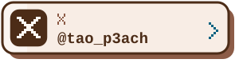
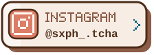
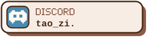
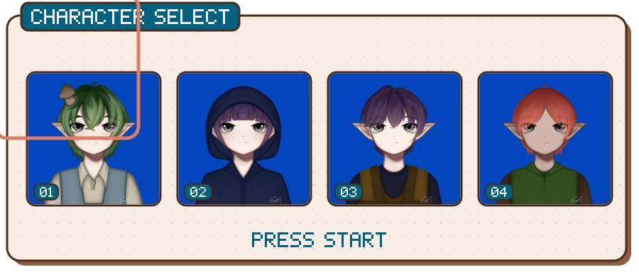

<!--
  hi future me ~
  · text on the cards lives in scripts/profile.mjs → edit it, then run:  node scripts/build-assets.mjs
  · artwork lives in assets/art/ (web-sized copies)
  · the header (it changes with the seasons) and the tide log are redrawn by
    .github/workflows/contributions.yml and published to the `output` branch
-->

  

 

