<!--
  hi future me ~
  · text on the cards lives in PROFILE at the top of scripts/build-assets.mjs
    → edit it, then run:  node scripts/build-assets.mjs
  · the tide log (contribution card) is redrawn by .github/workflows/contributions.yml
    and published to the `output` branch
-->

 

